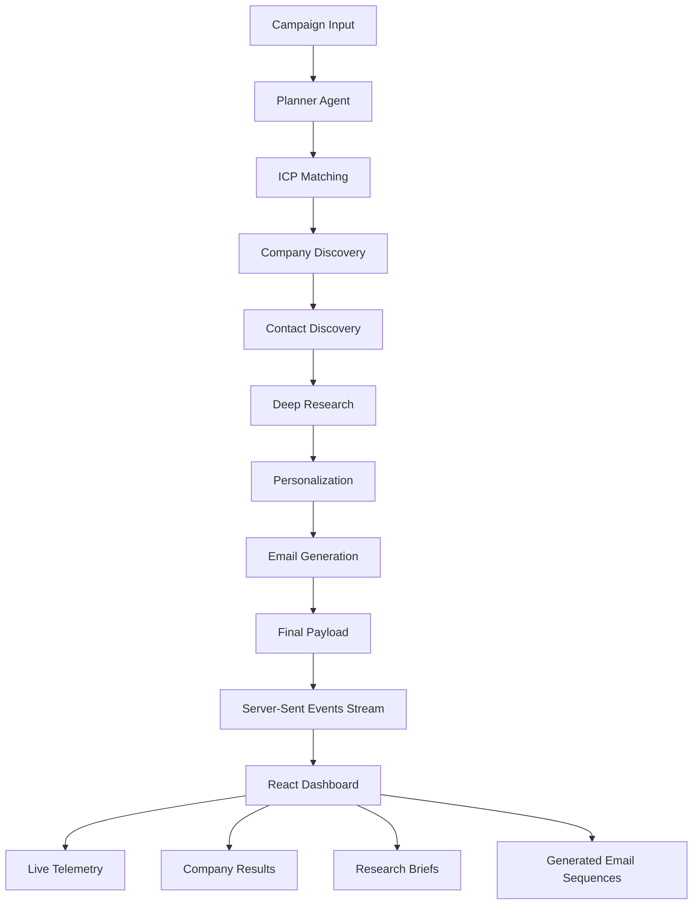

# Submission

## What I Built

FlyScout-AI is a **multi-agent outbound BDR platform** that automates prospect discovery and personalized outreach. A user defines a sales campaign by providing a product description, value proposition, and Ideal Customer Profile (ICP). The FastAPI backend orchestrates a seven-stage AI pipeline that progressively enriches campaign data and produces personalized outbound emails.

The pipeline consists of the following agents:

1. **Planner Agent** – Validates campaign input and initializes the execution plan.
2. **ICP Matching Agent** – Refines the target Ideal Customer Profile.
3. **Company Discovery Agent** – Identifies and ranks companies matching the ICP.
4. **Contact Discovery Agent** – Discovers relevant decision-makers for each company.
5. **Deep Research Agent** – Generates company-specific research briefs.
6. **Personalization Hooks Agent** – Creates personalized outreach insights from the research.
7. **Email Generation Agent** – Produces personalized outbound email sequences.

Throughout execution, the backend streams structured telemetry events to the React frontend using **Server-Sent Events (SSE)**. The dashboard visualizes the live progress of each AI agent and displays the final companies, research briefs, and generated email sequences after pipeline completion.

The application consists of a **React + Vite frontend** and a **FastAPI backend** communicating through REST APIs and real-time SSE telemetry.

---

# Demo / Results

The implemented solution demonstrates the following observable outcomes:

- **Companies discovered:** 3 enterprise companies
- **Research briefs generated:** 3 company-specific briefs
- **Personalized email sequences generated:** 3 outbound email sequences
- **Pipeline execution:** Successfully completed all seven processing stages
- **Live telemetry:** Real-time streaming of agent progress, execution status, and reasoning summaries
- **Final output:** Dashboard displays discovered companies, research briefs, and personalized email sequences after completion
- **Artifacts available:** Screenshots of the live telemetry dashboard, final recommendations, generated emails, and console logs showing the FINAL EVENT and FINAL PAYLOAD

---

# Architecture / Flow

### Pipeline Flow

1. The user creates an outbound campaign by providing product details, value proposition, and target ICP.
2. The frontend sends the campaign to the FastAPI backend.
3. The Planner Agent validates the request and initializes the execution pipeline.
4. Each subsequent AI agent enriches the campaign data before passing it to the next stage.
5. During execution, every agent emits structured telemetry events through a Server-Sent Events (SSE) stream.
6. The React frontend listens to the SSE stream using an `EventSource` connection and updates the dashboard in real time.
7. After the Email Generation Agent completes, the backend returns the final payload containing the discovered companies, research summaries, and generated email sequences.

### API Endpoints

- **GET /api/v1/health** — Service health check
- **GET /api/v1/campaigns** — Retrieve campaign information
- **POST /api/v1/pipeline/run** — Start the outbound AI pipeline
- **GET /api/v1/pipeline/stream/{job_id}** — Stream live telemetry events using SSE

### Data Flow Between Agents

- **Planner Agent** → Campaign brief and execution context
- **ICP Matching Agent** → Refined ICP
- **Company Discovery Agent** → Ranked company list
- **Contact Discovery Agent** → Company decision-makers
- **Deep Research Agent** → Company research briefs
- **Personalization Hooks Agent** → Personalized outreach insights
- **Email Generation Agent** → Personalized outbound email sequences

### Planner Responsibilities

The Planner Agent:

- Validates campaign inputs
- Initializes pipeline execution
- Coordinates agent execution order
- Maintains execution context
- Starts telemetry reporting

### Telemetry Streaming

Each agent emits structured JSON events containing:

- Current pipeline step
- Execution status
- Progress percentage
- Informational messages
- Intermediate execution data

These events are streamed through Server-Sent Events (SSE), allowing the frontend to visualize pipeline execution in real time.

---

# Why This Solves the Brief

The solution automates the complete outbound prospecting workflow by orchestrating multiple specialized AI agents. Instead of performing company discovery, contact identification, research, personalization, and email generation as isolated tasks, the platform combines them into a single end-to-end pipeline with real-time visibility.

The live telemetry dashboard enables users to monitor each stage of execution, while the modular agent architecture keeps responsibilities clearly separated and makes the workflow extensible for future enhancements.

---

# Evidence from the Codebase

The repository contains concrete implementation evidence including:

- FastAPI routers for health checks, campaigns, pipeline execution, companies, contacts, research, and email generation.
- A sequential multi-agent orchestration pipeline consisting of seven specialized AI agents.
- Server-Sent Events (SSE) implementation for streaming live pipeline telemetry.
- React + Vite frontend that visualizes pipeline progress and displays final campaign results.
- REST API integration between frontend and backend.
- Structured configuration using environment variables.
- Centralized logging, middleware, and global exception handling.
- Integration with external AI and search providers, including Gemini and Tavily.
- Typed frontend models and reusable UI components for campaign execution and telemetry visualization.

---

# Notes and Limitations

- Company discovery and research quality depend on the availability and quality of external search services.
- AI-generated content may vary based on the responses returned by external language models.
- External API rate limits may affect execution speed.
- The application currently focuses on outbound campaign generation and does not include authentication or user account management.
- Real-time telemetry depends on an active Server-Sent Events connection between the backend and frontend.

---

*This document summarizes the implemented solution based on the repository, application behavior, and the FlytBase Outbound BDR Hackathon problem statement.*